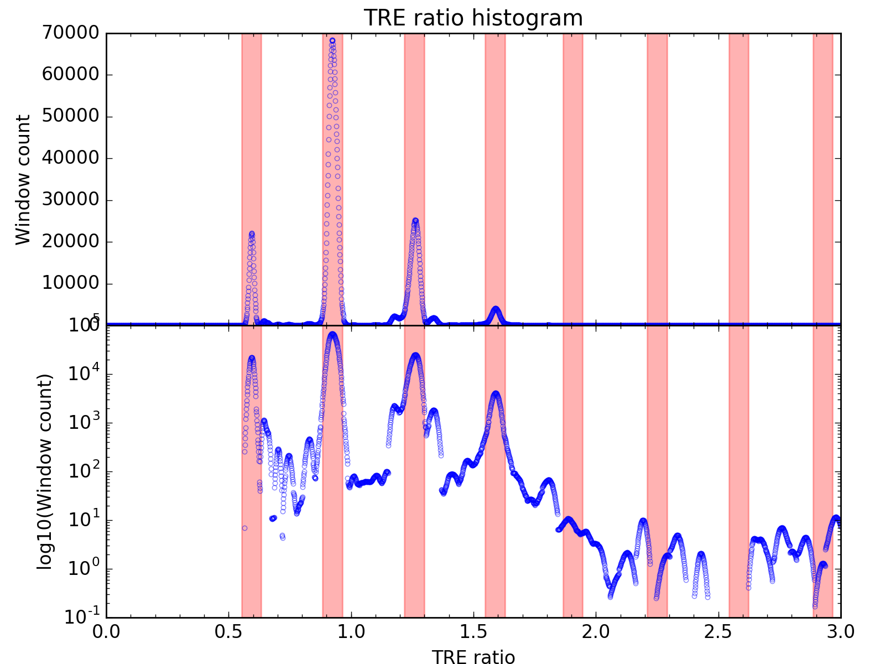
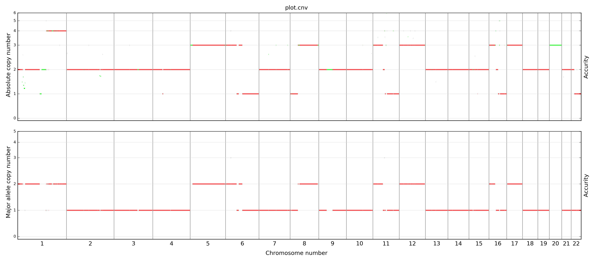
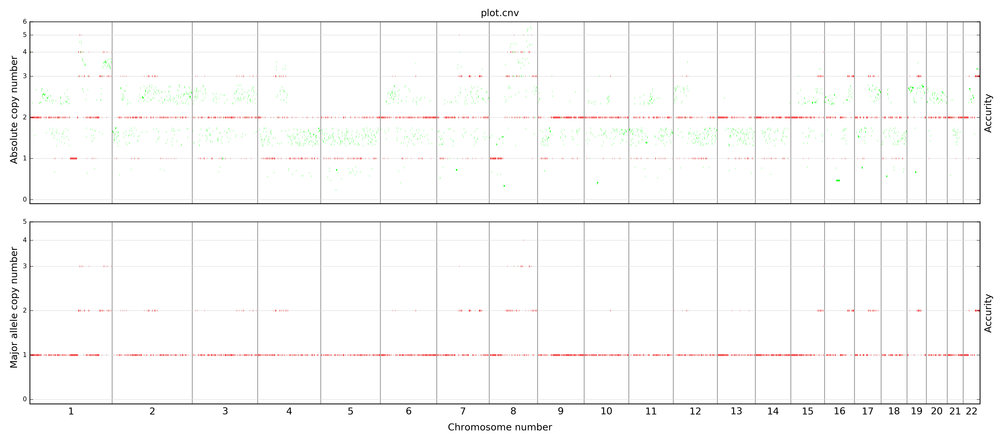

- [Introduction](#introduction)
  - [Publication](#publication)
- [License](#license)
- [Get our software](#get-our-software)
  - [News](#news)
  - [Register to receive updates](#register-to-receive-updates)
  - [Docker image](#docker-image)
  - [Install Accucopy and all its dependencies](#install-accucopy-and-all-its-dependencies)
    - [Prerequisites](#prerequisites)
    - [Install pyflow and other Python packages](#install-pyflow-and-other-python-packages)
    - [Register to download the Accucopy binary package and receive update emails](#register-to-download-the-accucopy-binary-package-and-receive-update-emails)
    - [Compile source code (for advanced users)](#compile-source-code-for-advanced-users)
  - [Download a reference genome](#download-a-reference-genome)
  - [Make your own reference genome package](#make-your-own-reference-genome-package)
- [Run Accucopy](#run-accucopy)
  - [Input bam files](#input-bam-files)
  - [Setup the configure file (latest format, as in the docker version)](#setup-the-configure-file-latest-format-as-in-the-docker-version)
  - [Example commandlines](#example-commandlines)
- [Simulated data for testing](#simulated-data-for-testing)
- [Accucopy output](#accucopy-output)
  - [A clean-data example](#a-clean-data-example)
  - [A noisy-data example](#a-noisy-data-example)
- [Feedback](#feedback)
- [FAQ](#faq)
  - ["At genomic regions of the first type, all cancer subclones have the same integral copy number....we call these regions clonal." Why is the copy number integral?](#at-genomic-regions-of-the-first-type-all-cancer-subclones-have-the-same-integral-copy-numberwe-call-these-regions-clonal-why-is-the-copy-number-integral)
  - ["How does Accucopy deal with multiple subclones(\>2)?"](#how-does-accucopy-deal-with-multiple-subclones2)

# Introduction

Accucopy is a CNA-calling method that extends our previous [Accurity](https://github.com/polyactis/Accurity) model to predict both total (TCN) and allele-specific copy numbers (ASCN) for the tumor genome. Accucopy adopts a tiered Gaussian mixture model coupled with an innovative autocorrelation-guided EM algorithm to find the optimal solution quickly. The Accucopy model utilizes information from both total sequencing coverage and allelic sequencing coverage. Through benchmark in both simulated and real-sequencing samples, we demonstrate that Accucopy is more accurate than existing methods

Accucopy's main strength is in handling low coverage and/or low tumor-purity samples.

## Publication

X Fan, G Luo, YS Huang# (2021) BMC Bioinformatics. [Accucopy: Accurate and Fast Inference of Allele-specific Copy Number Alterations from Low-coverage Low-purity Tumor Sequencing Data.](https://doi.org/10.1186/s12859-020-03924-5)

# License

The license follows our institute policy that you can use the program for free as long as you are using Accucopy strictly for non-profit research purposes. However, if you plan to use Accucopy for commercial purposes, a license is required and please contact polyactis@gmail.com to obtain one.

The full-text of the license is included in the software package.

# Get our software

## News

- 2023/6: Fixed the ploidy (must be within 1-4) bug.
- 2022/3: Commandline argument to allow user to choose which period (TRE histogram) to use.
- 2020/3: Can handle non-human genomes.
- 2019/10/22 First release.

## Register to receive updates

Please [register here](https://www.yfish.org/accucopy_reg/) to receive updates and the download link (a standalone Accucopy package without dependencies). If you have trouble installing packages described below, use the docker image instead.

## Docker image

NOTE  Due to the difficulty (i.e. no root access to install required libraries or incompatible libraries) in running our binary software, we have made a [docker image available at dockerhub](https://hub.docker.com/repository/docker/polyactis/accucopy), which contains the **latest development version** of our software and all dependent libraries. Accucopy inside the image is usually newer than what is downloadable from this website.

1. Install docker before you do anything below.
2. Download the [ref genome package](#download-a-reference-genome).
3. To run it on a HPC cluster, [singularity](https://singularity.lbl.gov/) might be a better fit than docker.

An example docker session:

```bash

yh@cichlet:~$ docker pull polyactis/accucopy
Using default tag: latest         
latest: Pulling from polyactis/accucopy
...                           
fd6992ef54e0: Pull complete
Digest: sha256:a6f72af3114ba903f26b60265e10e6f13b8d943d25e740ab0a715d1a99000188
Status: Downloaded newer image for polyactis/accucopy:latest
yh@cichlet:~$ docker images
REPOSITORY                  TAG                 IMAGE ID            CREATED             SIZE
polyactis/accucopy          latest              a11fdb62c5d4        5 months ago        1.04GB

# Get inside the image, without mounting. Useful to just check what's inside the image.
yh@cichlet:~$ docker run -i -t polyactis/accucopy /bin/bash

# Download the reference genome folder (links on this page) into /home/mydata (or any folder)
# Put your bam files into /home/mydata
# Mount /home/mydata to /mnt inside the image
# Get inside the docker image.
yh@cichlet:~$ docker run -i -t -v /home/mydata:/mnt polyactis/accucopy /bin/bash

root@cc7807445e40:/$ cd /usr/local/Accucopy/
/usr/local/Accucopy
root@cc7807445e40:/usr/local/Accucopy$ ls
GADA         maestre    main.py             plot_autocor_diff.py                  plot_snp_maf_peak.py
LICENSE      configure  plot.tre.autocor.R  plot_coverage_after_normalization.py  plot_tre.py
__init__.py  infer      plotCPandMCP.py     plot_snp_maf_exp.py

root@cc7807445e40:/usr/local/Accucopy$ ./main.py
usage: main.py [-h] [-v] -c CONFIGURE_FILEPATH -t TUMOR_BAM -n NORMAL_BAM -o
               OUTPUT_DIR [--snp_output_dir SNP_OUTPUT_DIR] [--clean CLEAN]
               [--segment_stddev_divider SEGMENT_STDDEV_DIVIDER]
               [--snp_coverage_min SNP_COVERAGE_MIN]
               [--snp_coverage_var_vs_mean_ratio SNP_COVERAGE_VAR_VS_MEAN_RATIO]
               [--max_no_of_peaks_for_logL MAX_NO_OF_PEAKS_FOR_LOGL]
               [--nCores NCORES] [-s STEP] [-l LAM] [-d DEBUG] [--auto AUTO]
main.py: error: argument -c/--configure_filepath is required
# modify file "configure" to reflect paths of input data and relevant binaries
root@cc7807445e40:/usr/local/Accucopy$ cat configure 
read_length     101
window_size     500
reference_folder_path   /mnt/hs37d5
samtools_path   /usr/local/bin/samtools
caller_path     /usr/local/strelka
binary_folder   /usr/local/Accucopy

root@cc7807445e40:/usr/local/Accucopy$ ls /usr/local/bin/
total 11640
-rwxrwxr-x  1 root root 4436160 Jul  7  2018 samtools*

```

## Install Accucopy and all its dependencies

### Prerequisites

- A computer with at least 32GB of memory (recommend 64GB).
- [Strelka2](https://github.com/Illumina/strelka). A variant caller that is used to call SNPs.
- Python
- matplotlib
- numpy
- pandas
- [Pyflow](https://github.com/Illumina/pyflow)
- [samtools](https://github.com/samtools/samtools))
- libbz2-1.0 (a high-quality block-sorting file compressor library,  install it via "apt install libbz2-1.0" in Debian/Ubuntu)
- If your OS (like CentOS) has this library installed but Accucopy still fails to load it, you can do a symlink from the installed libarary file to "libbz2.so.1.0".
- libgsl2
-liblzma5 (XZ-format compression library)
- libssl1.0.0
- libboost-program-options1.58.0
- libboost-iostreams1.58.0
- libhdf5-dev
- (Only for building from source) pkg-config: used by Rust compiler to find library paths. i.e. "pkg-config --libs --cflags openssl"
- (Optional) R packages ggplot2, grid, scales. Only needed if you obtain a development version of Accucopy. Required to make one R plot.
  - But the R plot is NOT a must-have, one python plot has similar content as the R plot.

Running Accucopy requires a project-specific configure file, details below. configure according to your OS environment.

### Install pyflow and other Python packages

```bash
git clone https://github.com/Illumina/pyflow.git pyflow
cd pyflow/pyflow
python setup.py build install
```

Other python packages can be installed through Python package system "pip install ..." or Ubuntu package system, dpkg/apt-get.

### Register to download the Accucopy binary package and receive update emails

Please [register here](https://www.yfish.org/accucopy_reg/) to receive an email that contains a download link.  After finishing download, unpack the package via this:

```bash
tar -xvzf Accucopy.tar.gz
```

The Accucopy package contains a few binary executables and R/Python scripts. All binary executables were compiled for the Linux platform (Ubuntu 18 tested). It also contains a sample configure file. Denote the full path of the Accucopy folder as accucopy_path in the configure file (described below).

NOTE

1. If you are having difficulty in getting Accucopy to work,  please use the docker image instead.
2. This binary package is older than the docker release.

### Compile source code (for advanced users)

Instead of downloading binary, you can also choose to compile the source code. Be forewarned, you may run into problems (missing packages, wrong paths, etc.) in compiling the C++ portion on non-Ubuntu platforms. Rust compiling is relatively easy.

Compiling Accucopy requires those "lib..." packages mentioned above and their corresponding development packages (for example, libbz2-dev). In addition, it requires an installation of Rust, https://www.rust-lang.org/.  We have compiled successfully on Ubuntu 16.04 and 18.04.

```bash
cd src_o

# to get a debug version (recommended)
make debug

# to get a release version
make release
```

The difference between debug and release version:

- The debug version will contain a Rust binary that can print a stack trace in case an error happens. It is only slightly slower than the release version Rust binary.
- The debug version will output more diagnostic plots.

NOTE

1. The public source code on github is older than the development version in the docker image. We advise users to use the latest version that is encapsulated in the docker image.

## Download a reference genome

Accucopy requires a reference genome folder to run. We provide two different versions of human reference genomes, hs37d5 and hs38d1.

We recommend users to re-align reads against one of our pre-packaged human genomes in order to minimize any unexpected errors. However, if your reference genome is not human or slightly different (i.e. a different hs38 variant) from our pre-packaged ones (and you do not want to re-align), you can make a new reference genome folder by following instructions below.

The snp file inside the ref genome zip file contains coordinates of common (allele frequency >10%) SNPs from the 1000 Genomes project. **The chromosome coordinates are denoted as "chr1", not "1".** We advise users to align reads against the genome file included in the package to re-generate their bam files, in order to minimize wrong alignments and more importantly, match the coordinates of the 1000Genomes SNP file.

- [hs38d1.7z](http://www.yfish.org/static/hs38d1.7z) (714MB, NCBI hs38 is equivalent to UCSC hg20)
- [hs37d5.7z](http://www.yfish.org/static/hs37d5.7z) (718MB, NCBI hs37 is equivalent to UCSC hg19)

We use the [7z](https://www.7-zip.org/) compressor. Run ```7z x hs38d1.7z``` to extract all files.

## Make your own reference genome package

Accucopy can also work on non-human genomes. Here are the instructions to make a custom reference genome folder. This folder should contain these files:

1. genome.fa: the fasta file of the reference genome.
2. genome.fa.fai: the index file of genome.fa by "samtools faidx".
3. genome.dict: the chromosome:length dictionary file generated by Picard CreateSequenceDictionary.
   - https://gatkforums.broadinstitute.org/gatk/discussion/1601/how-can-i-prepare-a-fasta-file-to-use-as-reference
4. snp_sites.gz: the common SNP file in the bed format, 3 columns:

```text
chr1    14598   14599
chr1    14603   14604
chr1    14929   14930
```

5. snp_sites.gz.tbi: the index file of snp_sites.gz generated by tabix.

**Make sure the chromosome coordinates are denoted as "chr1", not "1".** Non-numerically-labelled chromosomes (i.e. X, Y) are ignored by our software.

# Run Accucopy

## Input bam files

For an example, you have a pair of matched tumor and normal samples.

- sample_1_cancer.bam
- sample_1_cancer.bam.bai
- sample_1_normal.bam
- sample_1_normal.bam.bai

**.bam.bai** files (bam index) are not required. Accucopy will call samtools to generate them if they are missing.

## Setup the configure file (latest format, as in the docker version)

Copy the sample configure file (tab-delimited) from the Accucopy package into your project folder and modify it accordingly. An example looks like this:

```text
read_length     101
window_size     500
reference_folder_path   /mnt/hs38d1
samtools_path   /usr/local/bin/samtools
caller_path    /usr/local/strelka
accucopy_path   /usr/local/Accucopy
```

- read_length: read length in base pairs.
- window_size: the window size in base pair for segmentation. The segmentation program (GADA) first calculates the number of reads for each window and then perform segmentation over the genome. A small window size often leads to a large number of small segments. The recommended window size is 500bp.
- reference_folder_path: the path of the genome folder. Two human versions are downloadable from this site. You can make a custom one.
- samtools_path: the path of the samtools binary
- caller_path: the path of the 3rd-party variant calling program.  We use Strelka2. This is the path of the folder that contains all Strelka2 code/executables, i.e. /usr/local/strelka.
- accucopy_path: the path of the Accucopy software.

## Example commandlines

Accucopy consists of several binary executables. To make everything easy, we have written a Python program ```main.py``` ( inside the "Accucopy" folder ) which wraps all binary executables in a workflow.

```./main.py –h``` gives you an explanation of all the arguments:

```bash
yh@hello:~/Accucopy$ ./main.py  -h
usage: main.py [-h] -c CONFIGURE_FILEPATH -t TUMOR_BAM -n NORMAL_BAM -o
               OUTPUT_DIR [--snp_output_dir SNP_OUTPUT_DIR] [--clean CLEAN]
               [--segment_stddev_divider SEGMENT_STDDEV_DIVIDER]
               [--snp_coverage_min SNP_COVERAGE_MIN]
               [--snp_coverage_var_vs_mean_ratio SNP_COVERAGE_VAR_VS_MEAN_RATIO]
               [--max_no_of_peaks_for_logL MAX_NO_OF_PEAKS_FOR_LOGL]
               [--nCores NCORES] [-s STEP] [-l LAM] [-d DEBUG] [--auto AUTO]

optional arguments:
  -h, --help            show this help message and exit
  -c CONFIGURE_FILEPATH, --configure_filepath CONFIGURE_FILEPATH
                        the path to the configure file.
  -t TUMOR_BAM, --tumor_bam TUMOR_BAM
                        the path to the tumor bam file. If the bam is not
                        indexed, an index file will be generated
  -n NORMAL_BAM, --normal_bam NORMAL_BAM
                        the path to the normal bam file. If the bam is not
                        indexed, an index file will be generated
  -o OUTPUT_DIR, --output_dir OUTPUT_DIR
                        the output directory path.
  --snp_output_dir SNP_OUTPUT_DIR
                        the directory to hold the SNP calling output. Default
                        is the same folder as the bam file.
  --clean CLEAN         whether to remove the existing output folders and
                        files? 0 No, 1 Yes. Default is 0.
  --segment_stddev_divider SEGMENT_STDDEV_DIVIDER
                        A factor that reduces the segment noise level. The
                        default value is recommended. Default is 20.
  --snp_coverage_min SNP_COVERAGE_MIN
                        the minimum SNP coverage in adjusting the expected SNP
                        MAF. Default is 2.
  --snp_coverage_var_vs_mean_ratio SNP_COVERAGE_VAR_VS_MEAN_RATIO
                        Instead of using the observed SNP coverage variance
                        (not consistent), use coverage_mean X this-parameter
                        as the variance for the negative binomial model which
                        is used in adjusting the expected SNP MAF. Default is
                        10.
  --max_no_of_peaks_for_logL MAX_NO_OF_PEAKS_FOR_LOGL
                        the maximum number of peaks used in the log likelihood
                        calculation. The final logL is average over the number
                        of peaks used. Default is 3
  --nCores NCORES       the max number of CPUs to use in parallel. Increase
                        the number if you have many cores. Default is 2.
  -s STEP, --step STEP  0: start from the very begining (Default).
                        1: obtain the read positions and the major allele fractions.
                        2: normalization. 3: segmentation. 4: infer purity and
                        ploidy only.
  -l LAM, --lam LAM     lambda for the segmentation algorithm. Default is 4.
  -d DEBUG, --debug DEBUG
                        Set debug value. Default is 0, which means no debug
                        output. Anything >0 enables several plots being made.
  --auto AUTO           The integer-valued argument that decides which method
                        to use to detect the period in the read-count ratio
                        histogram. 0: the simple auto-correlation method. 1: a
                        GADA-based algorithm (recommended). Default is 1.
```

In the debug mode (-d 1), Accucopy will produce several intermediate plots, offering insights into how well it is handling the input data.

Run Accurity from scratch given two input bam files, use 30 cores, output to folder sample_1_infer, enable debug mode:

```bash
./main.py -c configure_file --nCores 30 -t sample_1_cancer.bam -n sample_1_normal.bam -o sample1_output -d 1
```

Resume Accurity from step 2 and change the snp output folder (default was the bam file folder)

```bash
./main.py -c configure_file --nCores 20 -t sample_1_cancer.bam -n sample_1_normal.bam -o sample1_output --snp_output_dir sample1_output -d 1 --step 2
```

Override all previous output:

```bash
./main.py -c configure_file -t sample_1_cancer.bam -n sample_1_normal.bam -o sample1_output -d 1 --clean 1
```

# Simulated data for testing

We generated in silico tumor and matching-normal WGS data using an EAGLE-based workflow. EAGLE is a software developed by Illumina to mimic their own high-throughput DNA sequencers and the simulated reads bear characteristics that are close to real-sequencing reads. We introduced twenty-one somatic copy number alterations (SCNAs), with length varying from 5MB to 135MB and copy number from 0 to 8, affecting about 28% of the genome, to each simulated tumor genome. The entire genome of its matching normal sample is of copy number two. A total of 1.8 million heterozygous single-nucleotide loci were introduced to each normal and its matching tumor sample. For each coverage setting, we first generated a pure tumor sample (purity=1.0) and its matching normal sample. We then generated nine different impure tumor samples (purity from 0.1 to 0.9) by data of the pure tumor sample with its matching normal data. The mixing proportion determines the tumor sample’s true purity.

Due to space constraints on our public server, we can only provide simulation data of tumor samples that contain only one subclone. If you need simulated data with more subclones or HCC1187 mixed data, please contact us.

Here is the http list of one simulated normal sample (coverage=5X) and nine simulated tumor samples (coverage=2X), with purity from 0.1 to 0.9, for researchers to test their own method.

- https://www.yfish.org/data/singleclone_2x/

The true CNA profile of all tumor samples is identical (that's why it's called singleclone, no other subclones) and can be downloaded from https://www.yfish.org/data/singleclone_2x/CNA_truth.tsv. Here is what each column means.

- Column ```cp``` is the total copy number of the designated region.
- Column ```major_allele_cp``` is the copy number of the major allele. The copy number of the minor allele = ```cp - major_allele_cp```.
- Please ignore the ```IsClonal``` column.
- Regions not included in the file are of copy number two.

```
chr     start   end     cp      major_allele_cp IsClonal
chr1    200000000       240000000       3       2       T
chr2    20000000        25010000        4       3       T
chr2    40000000        45000000        1       1       T
chr3    50000000        100000000       8       7       T
chr4    40000000        80000000        1       1       T
chr10   30000000        45000000        2       2       T
chr20   3000000 45000000        3       3       T
chr15   20000000        40000000        7       6       T
chr17   10000000        60000000        5       4       T
chr8    10000000        145000000       3       2       T
chr1    135000000       185000000       5       3       T
chr2    80000000        130000000       4       2       T
chr5    30000000        75000000        6       4       T
chr6    50000000        90000000        6       3       T
chr7    90000000        130000000       7       5       T
chr12   25000000        65000000        7       4       T
chr11   80000000        130000000       4       4       T
chr12   85000000        120000000       5       5       T
chr13   25000000        65000000        6       6       T
chr14   30000000        45000000        7       7       T
chr15   50000000        90000000        8       8       T
```

# Accucopy output

These are the output files that matters.

- infer.out.tsv
  - A summary output that contains purity and ploidy estimates, and some other statistical measures. Probably the most important file to a user.

```text
purity  ploidy
0.66735 2.0612
logL    period  best_no_of_copy_nos_bf_1st_peak first_peak_int
9.9811e+06      327     2       980
no_of_segments  no_of_segments_used     no_of_snps      no_of_snps_used
539     539     1333539 933576
```

- infer.out.details.tsv
  - This contains lots of internal model output, useful for developers.
- cnv.output.tsv
  - This contains preliminary copy number alteration predictions.
  - The important columns are chr, start, end.
  - "cp" is the predicted copy number.
  - "copy_no_float" is the raw copy number outputted by our program, which will be converted to an integer (the "cp" column) if our model deems it a clonal (shared by all cancer cells) CNV. Some "cp" will stay as "float" because our model thinks they are subclonal (some cancer cells in one CNV state, some cancer cells in another).

```text
chr     start      end        cp      major_allele_cp copy_no_float   oneSegment.stddev       maf_mean        maf_stddev      maf_expected   cumu_start   cumu_end
5       8215001 8363001       2       1       1.76147 0.00987896      0.622568        0.0685194       0.632948        895215001       895363001
3       16591001        16751001       2       1       1.76758 0.00891515      0.62856 0.063834        0.632948        511591001       511751001
...
```

- plot.cnv.png
  - A genome-wide CNV plot.

- plot.tre.jpg
  - A period plot. Check if the model fits data well.

- plot.tre.autocor.jpg
  - A plot for developers.

## A clean-data example

All major results are stored in the output directory. File sample_1_infer/infer.out.tsv contains the purity and ploidy estimates. Here is an example. (Viewing in Excel is a lot nicer) :

```text
purity        ploidy       purity_naive     ploidy_naive    rc_ratio_of_cp_2      rc_ratio_of_cp_2_corrected      segment_stddev_divider         snp_maf_stddev_divider  snp_coverage_min   snp_coverage_var_vs_mean_ratio    period_discover_run_type
0.7246      2.2428      0.72078    2.2282      924  919.13      10     20     2       10     1
logL period       best_no_of_copy_nos_bf_1st_peak first_peak_int
1.5204e+07      333  1       585
no_of_segments       no_of_segments_used      no_of_snps       no_of_snps_used
697  697  1517851  1062619
```

- In the output above, the column ‘purity’ is the final purity estimate, and ‘purity_naive’ is the pre-adjusted estimate which can be ignored. ‘logL’ is the maximum likelihood of the hierarchical Gaussian Mixture model. ‘period’ is the 1000 X period of the tumor-read-enrichment (TRE) histogram (=333 in this case), which is detected by auto-regression. 'no_of_snps' and ‘no_of_segments’ is the result of step 3 and step 4. Other columns are values of commandline arguments.
- There are other important output files, such as all_segments.tsv.gz and het_snp.tsv.gz, which are output of step 4 and step 3 respectively. If the sample is abnormal, we can usually see an unreasonable number of segments and SNPs in these two files.
- Besides the text output, Accucopy will produce some graphic output. One of the the most important plots is plot.tre.png, ```available only in debug mode ( -d 1)```:



- TRE stands for Tumor Read Enrichment. You can think of it as a normalized version of the read count ratio between the tumor and normal samples for one chromosome window. More details can be found in our paper. The Y axis in the two panels is the window count. The lower panel is in the log scale. A clean TRE histogram leads to a confident purity estimate.
- In this clean-data example, the tumor read enrichment (TRE) histogram displays a beautiful periodic pattern. That means we can confidently infer the period (=0.333) from the TRE data and the ensuing maximum likelihood estimates will be more robust. The CNV estimates in plot.cnv.png, also demonstrates a clean copy number variation (CNV) profile.

- plot.cnv.png:



This is the estimated CNV profile for the example. The top plot is the estimated absolute copy number for each segment. For a normal sample, the absolute copy number should be 2 throughout the genome. The lower plot shows the major allele copy number for each segment.

Cases where Accucopy fails to infer purity and ploidy:

1. The cancer genome contains too few somatic copy number alterations.
2. The noise level is too high, or the noise level is moderate but the sample purity is very low (<0.05).

## A noisy-data example

Occasionally, a user will encounter extremely noisy data. The user should learn to identify the noisy data from plots and do NOT use the estimates made by Accucopy. Here is a noisy-data example.

Content of infer.out.tsv for a noisy-data example. The high number of segments is a red flag.

```text
purity        ploidy       purity_naive     ploidy_naive    rc_ratio_of_cp_2      rc_ratio_of_cp_2_corrected         segment_stddev_divider   snp_maf_stddev_divider  snp_coverage_min   snp_coverage_var_vs_mean_ratio         period_discover_run_type
0.90938    1.9375      0.91675    1.9551      1021 1029.3      10     20     2       10     2
logL period       best_no_of_copy_nos_bf_1st_peak first_peak_int
4.3681e+06      468  1       555
no_of_segments       no_of_segments_used      no_of_snps       no_of_snps_used
19909       19909       1559676  1092048
```

Its tumor-read-enrichment (TRE) histogram (plot.tre.png) has one big and unclean peak (its landscape looks like being cut through by a lousy jigsaw). It makes it really difficult to accurately estimate its period. The period estimate (0.468,  468 in the 2nd cell of the 4th line is 1000Xperiod.) is probably far from the truth. All ensuing maximum likelihood estimates are questionable. The estimated CNV profile further confirms the great amount of noise in this data.


- plot.cnv.png:



# Feedback

If you encounter any issues, please email polyactis@gmail.com or file an issue at  https://github.com/polyactis/Accucopy/issues (so that everyone can learn).

# FAQ

## "At genomic regions of the first type, all cancer subclones have the same integral copy number....we call these regions clonal." Why is the copy number integral?

Integer copy number estimates, like 1, 2, 3, are easy to understand. But some regions are of fractional (2.3, 3.5) copy numbers because:

1. The sequencing data is a mixture of thousands or even millions of cells , which is called batch sequencing (not single-cell sequencing).
2. A tumor is usually not homogeneous, so some cancer cells differ from others in terms of copy numbers. For example, in one region, 50% cells are of copy number 2, the other 50% are of copy number 3. Then you'll see 2.5 as a whole. These regions are called subclonal.

## "How does Accucopy deal with multiple subclones(>2)?"

Accucopy does not estimate the number (or fractions) of cancer subclones. Accucopy tells the user whether a region is clonal or subclonal, and their corresponding copy number estimates.

Please note. "subclone" and "subclonal" are referring to different things.

- "subclone" or "clone" refers to a lineage of cancer cells during the cancer cell evolution process.
- "subclonal" or "clonal" is referring to mutations. "Subclonal" mutations are the ones that lead to a type of cancer subclones on the evolutionary branch, and thus these are the mutations that not shared across all cancer cells in the tumor sample. "Clonal" mutations are the ones that are shared across all cancer cells.
